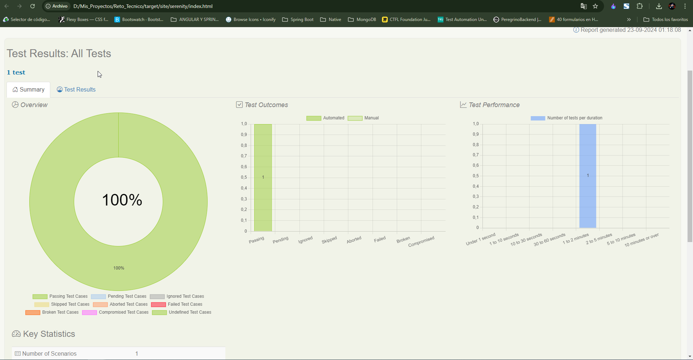
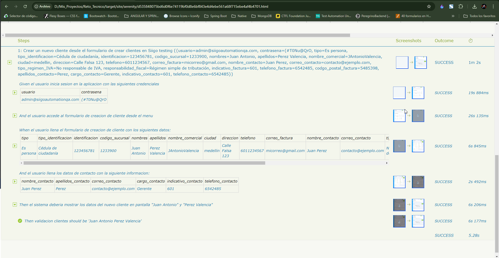
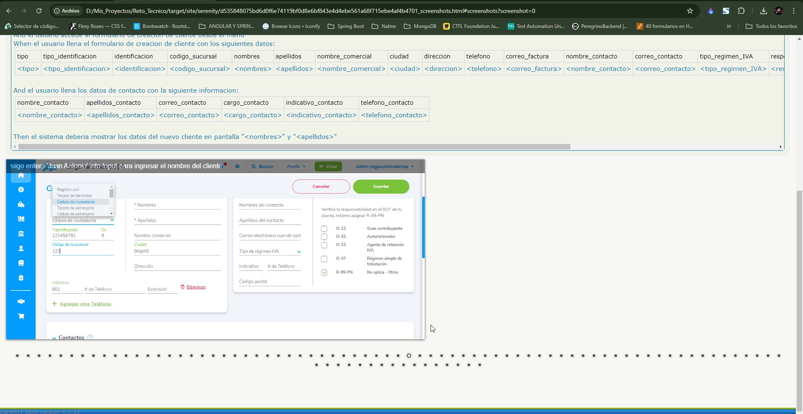
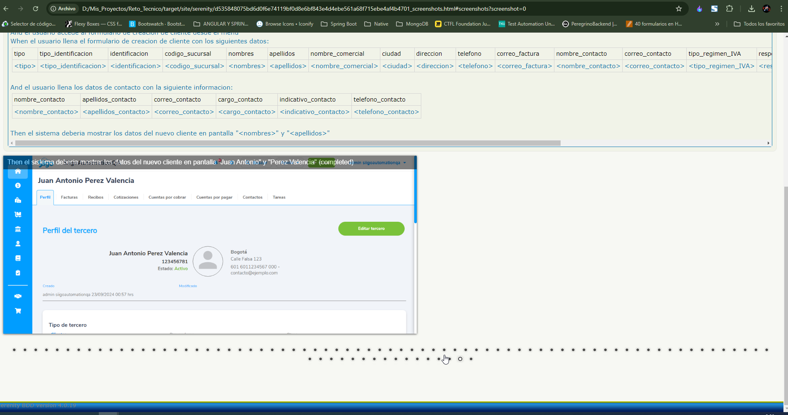

# Proyecto de Automatización de Pruebas - Siigo

Este proyecto contiene pruebas automatizadas para la creación de clientes en la aplicación Siigo.

## Requisitos

- Java (versión 17 o superior)
- Gradle (versión 8 o superior)
- Cucumber
- SerentyBDD (versión 4.2.0)

## Instalación

1. Clona el repositorio:
   ```bash
   git clone https://github.com/mimarumo25/Reto_Automatizacion.git
   cd siigo-automation# Proyecto de Automatización de Pruebas - Siigo

Este proyecto contiene pruebas automatizadas para la creación de clientes en la aplicación Siigo.

### Resultados de ejecución







